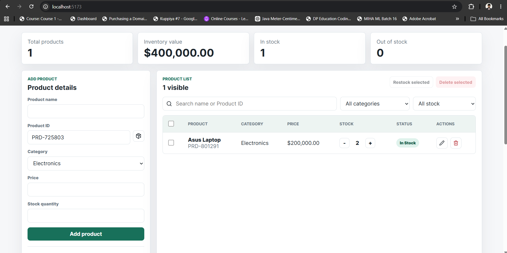
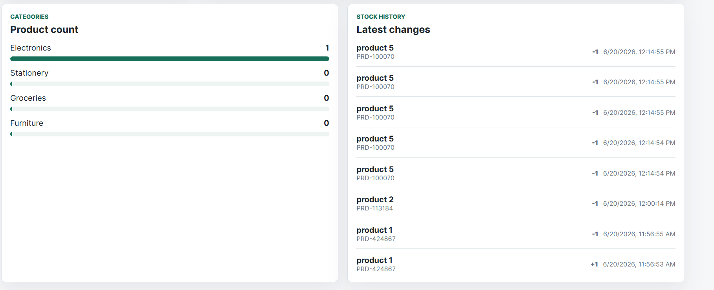

# Inventory Management System

A frontend-only inventory management application built with React, Formik, Yup, and localStorage. It helps users manage products, track stock levels, organize categories, search inventory, and view dashboard statistics without a backend.

## Features

- Add, edit, and delete products
- Product fields: Product Name, Product ID, Category, Price, and Stock Quantity
- Formik forms with Yup validation and clear error messages
- Auto-generated Product ID/SKU
- localStorage persistence for products, categories, theme, and stock history
- Increase and decrease stock safely, with stock prevented from going below zero
- Dashboard with total products, total inventory value, in-stock count, and out-of-stock count
- Custom category creation and product count per category
- Search by product name or Product ID
- Filter by category and stock status
- Responsive table layout for desktop and mobile
- CSV export
- Dark/light theme toggle
- Stock history log
- Bulk delete and bulk restock actions

## How To Run Locally

```bash
npm install
npm run dev
```

Then open the local URL shown in the terminal.

## Build

```bash
npm run build
```

## Screenshots


#### Dashboard View


#### Product Management Form

